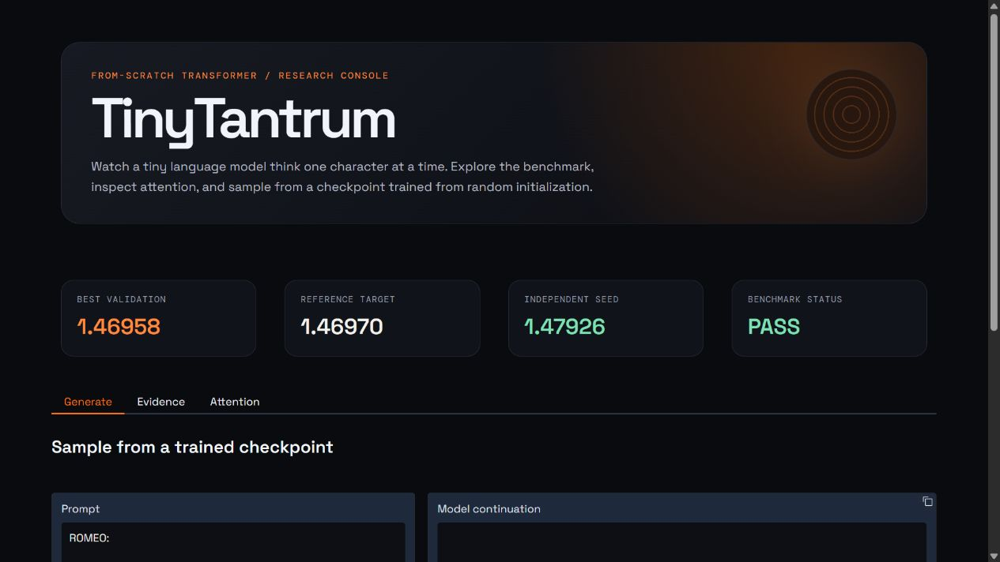

# TinyTantrum

[](https://github.com/Yumekaz/TinyTantrum/actions/workflows/ci.yml)
[](https://www.python.org/)
[](https://pytorch.org/)

TinyTantrum is a reproducible, from-scratch character-level GPT laboratory. It implements the tokenizer, transformer blocks, causal attention, training loop, checkpoint recovery, benchmark evaluation, controlled ablations, interpretability tooling, and generation path directly around PyTorch tensors and autograd.

The project is designed as a transparent ML engineering and experimental research artifact: every important training decision is inspectable, every result is reproducible within its stated conditions, and the limitations are explicit.



## Why it matters

TinyTantrum is intentionally small enough to understand end to end, but complete enough to answer meaningful engineering questions:

- Can a hand-built transformer reproduce a reference validation result?
- Does the result survive an independent evaluation and a second random seed?
- How much do context length and positional information affect performance?
- What measurable routing patterns appear in the learned attention heads?

This is not presented as a new architecture or a state-of-the-art language model. The value is in the complete, inspectable experimental system.

## Verified results

The reference configuration reached a validation loss of **1.4695779** using an independent 200-batch evaluation, against the reference value of approximately **1.4697**.

| Check | Result |
| --- | ---: |
| Reference validation loss | **1.4695779** |
| Reference target | **1.4697** |
| Independent seed validation loss | **1.4792602** |
| Benchmark status | **PASS** |

### Context-length ablation

Under a fixed 2,000-step budget, longer context improved validation loss:

| Context length | Best validation loss |
| ---: | ---: |
| 64 | 1.5546164 |
| 128 | 1.4857790 |
| 256 | 1.4755781 |

### Positional-information ablation

Using the same seed, architecture, dataset, and 2,000-step budget, removing learned positional embeddings increased independent validation loss from **1.4626713** to **1.5620605**—approximately a **6.8%** deterioration.

The detailed evidence is available in [results/benchmark.md](results/benchmark.md), [results/reproducibility.json](results/reproducibility.json), and [results/release_report.md](results/release_report.md).

## What is implemented

- Deterministic character tokenizer and corpus split
- Hand-written embeddings, layer normalization, causal multi-head attention, feed-forward blocks, and residual connections
- AdamW training with warmup, cosine decay, gradient clipping, and live progress logging
- Atomic checkpoints containing model, optimizer, RNG, configuration, and step state
- Exact interrupted-vs-uninterrupted resume verification
- Independent evaluation and autoregressive generation commands
- Context-length and positional-embedding ablation tooling
- Attention statistics, heatmaps, and an interpretability report
- Interactive dashboard over the same checkpoint and generation code
- Automated tests through GitHub Actions

## Reproduce locally

Create an environment and run the tests:

```powershell
python -m venv .venv
.\.venv\Scripts\Activate.ps1
python -m pip install -e ".[dev]"
python -m pytest -q
```

For a quick CPU smoke test:

```powershell
python scripts\train_model.py --steps 20 --layers 1 --heads 2 --embedding-size 64 --context-length 64 --batch-size 8 --dropout 0
```

The full reference run is intended for a GPU:

```powershell
python scripts\train_model.py --steps 5000 --batch-size 64 --context-length 256 --layers 6 --heads 6 --embedding-size 384 --dropout 0.2 --seed 1337 --checkpoint artifacts\checkpoints\full_run.pt --metrics runs\full_run_metrics.json
```

Evaluate a best checkpoint:

```powershell
python scripts\evaluate_model.py --checkpoint artifacts\checkpoints\full_run_best.pt --batches 200
```

Generate text:

```powershell
python scripts\generate_text.py --checkpoint artifacts\checkpoints\full_run_best.pt --prompt "ROMEO:" --tokens 400 --temperature 0.8 --top-k 20
```

Run the controlled architectural ablation on a GPU:

```powershell
python scripts\run_architecture_ablation.py --steps 2000 --batch-size 64 --context-length 256 --layers 6 --heads 6 --embedding-size 384 --dropout 0.2 --seed 1337
```

## Checkpoints and dashboard

The large `.pt` files are kept out of Git so the source repository stays lightweight. Download the checkpoint bundle from the [v0.1.0 release](https://github.com/Yumekaz/TinyTantrum/releases/tag/v0.1.0) and extract it at the repository root. The archive preserves the expected `artifacts\checkpoints\` layout.

Then launch the dashboard:

```powershell
python -m pip install -e ".[dashboard]"
python scripts\dashboard.py
```

The dashboard lets you sample from a trained checkpoint, compare benchmark evidence, and inspect attention maps. It is a presentation layer over the same model and generation code; it is not part of the benchmark proof.

To package locally generated checkpoints for another release:

```powershell
python scripts\package_artifacts.py
```

This creates `dist\tinytrantrum-checkpoints.zip` with a SHA-256 manifest.

## Interpretability

Generate the attention report from the local best checkpoint:

```powershell
python scripts\generate_attention_report.py
```

The report is written to [results/attention/report.md](results/attention/report.md), alongside measurable head statistics and selected heatmaps. It treats attention patterns as behavioral evidence, not proof of human-interpretable semantic roles.

## Project structure

```text
src/tinytrantrum/    model, tokenizer, training, checkpointing, analysis
scripts/             training, evaluation, ablation, dashboard, reporting
tests/               model, data, checkpoint, resume, and entrypoint tests
results/             benchmark evidence, reports, plots, and dashboard capture
```

## Limitations

This is a small character-level model trained on Tiny Shakespeare. Generated text is qualitative evidence only. The context ablation controls training steps rather than equal compute. The project does not claim a novel architecture, state-of-the-art language modeling performance, or semantic understanding from attention maps.
